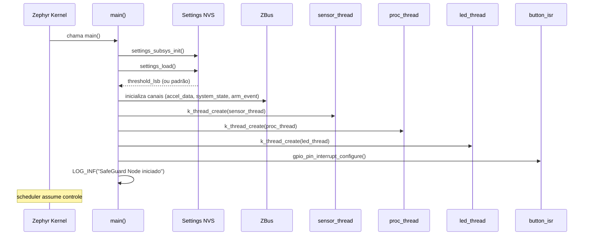
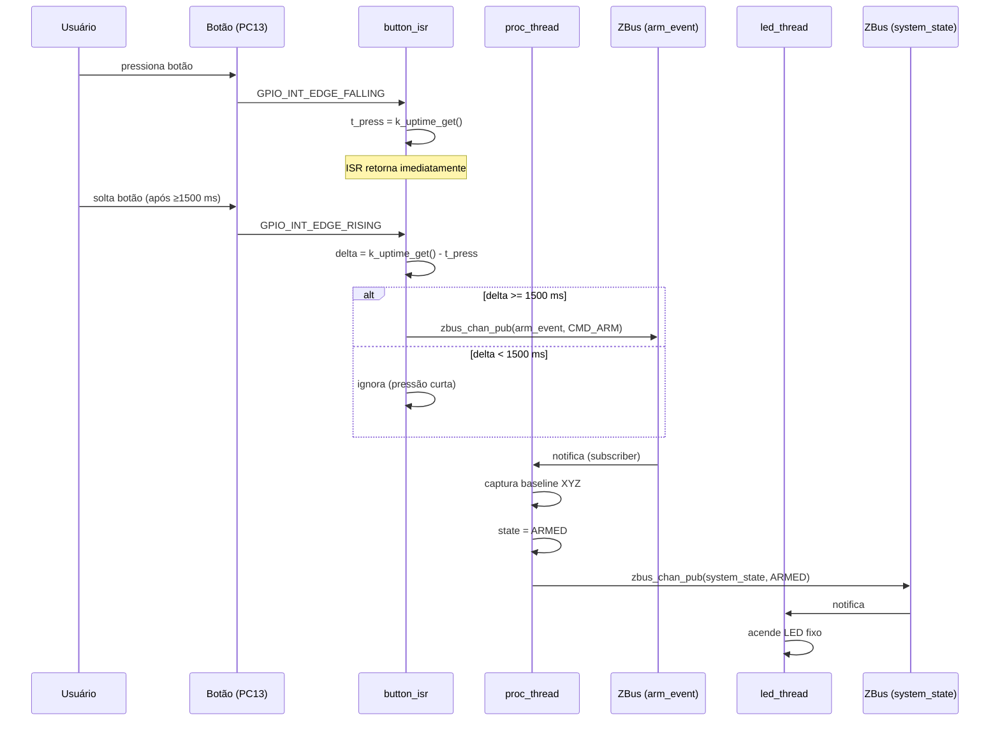
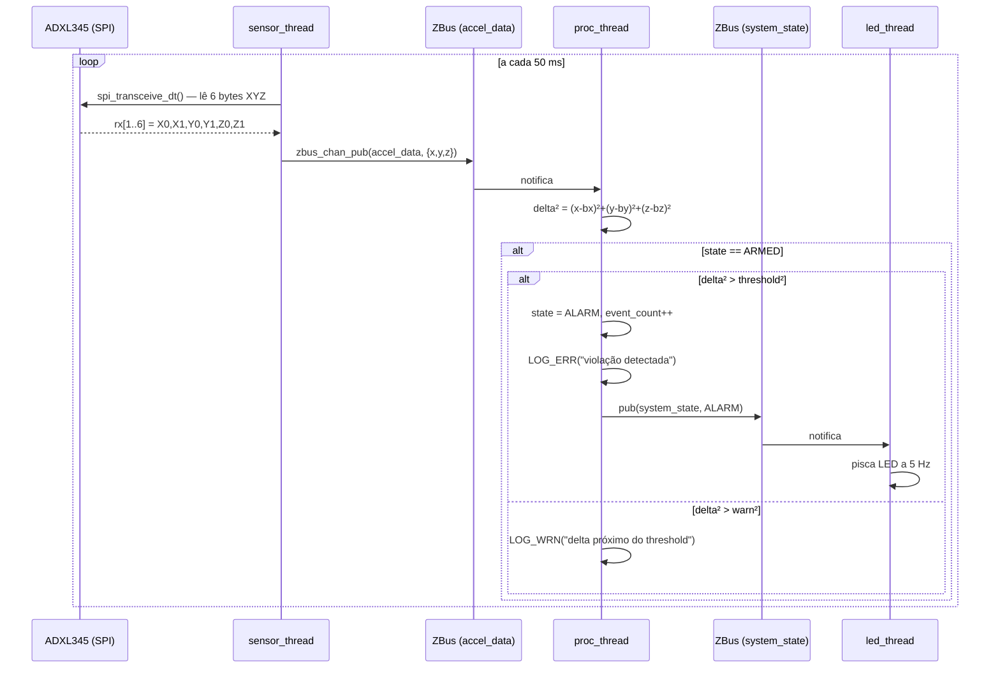
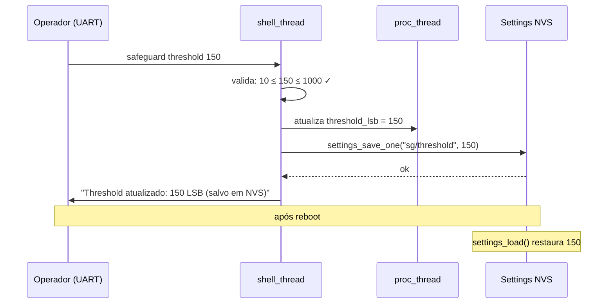
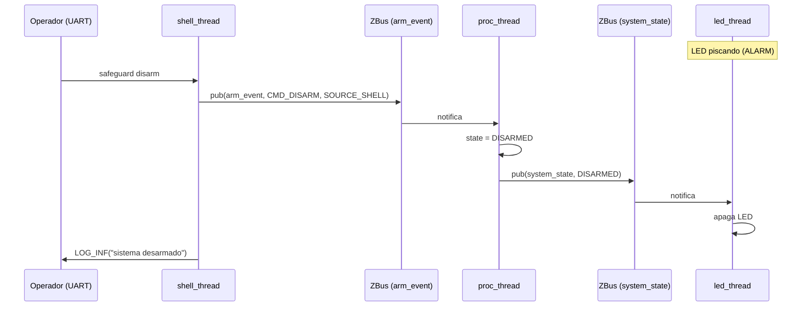
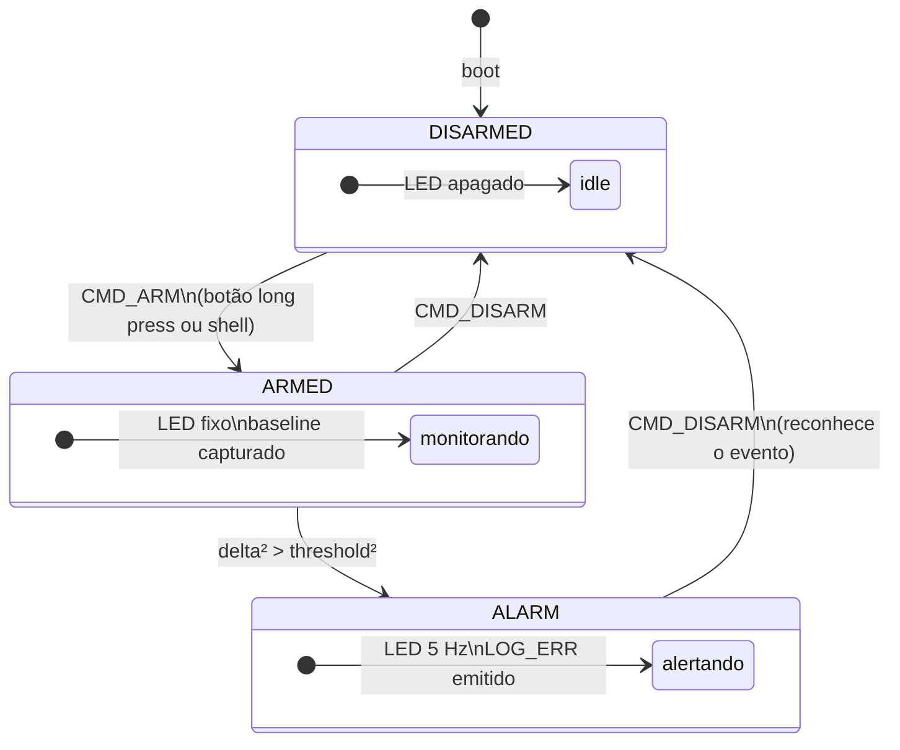

# Diagramas de Interação — SafeGuard Node

Diagramas em sintaxe Mermaid (renderizados no GitHub e em editores compatíveis).

---

## 1. Boot e inicialização

Sequência executada uma vez na inicialização do firmware.



---

## 2. Arme via botão físico (long press)



---

## 3. Detecção de impacto



---

## 4. Comando shell — alteração de threshold



---

## 5. Reconhecimento de alarme via shell



---

## 6. Fluxo completo de estados



---

## 7. Arquitetura de threads e canais (visão estática)

```
┌─────────────────┐    accel_data     ┌─────────────────┐    system_state   ┌─────────────────┐
│  sensor_thread  │ ─────────────────►│  proc_thread    │ ─────────────────►│   led_thread    │
│                 │   {x, y, z}       │                 │   {state, count}  │                 │
│  spi_transceive │                   │  FSM + detect   │                   │  LED pattern    │
│  50 ms period   │                   │  baseline       │                   │  by state       │
└─────────────────┘                   └────────┬────────┘                   └─────────────────┘
                                               │ arm_event
                                               │ {CMD_ARM / CMD_DISARM}
                                    ┌──────────┴──────────┐
                              ┌─────┴─────┐         ┌─────┴──────┐
                              │button_isr │         │shell_thread│
                              │ long press│         │ safeguard *│
                              └───────────┘         └────────────┘
```
